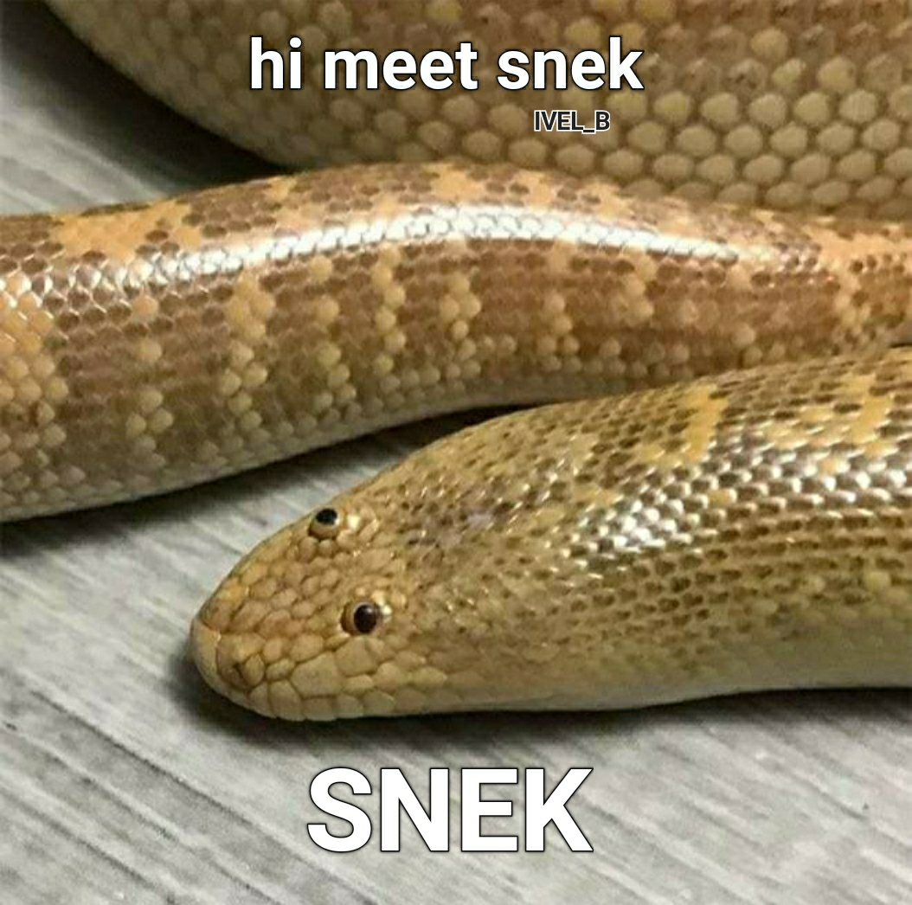

# snek bot

A snake game AI written in C using ncurses.  
Can also be played manually but why would you do that?  
This project is very much in development.  

## Controls

    h, ←    move left
    j, ↓    move down
    k, ↑    move up
    l, →    move right

    <space> toggle pause
    q       quit

## Bot Info
- [https://en.wikipedia.org/wiki/A*_search_algorithm](https://en.wikipedia.org/wiki/A*_search_algorithm)  
- [https://www.youtube.com/watch?v=-L-WgKMFuhE](https://www.youtube.com/watch?v=-L-WgKMFuhE)  
- [https://johnflux.com/category/nokia-6110-snake-project/](https://johnflux.com/category/nokia-6110-snake-project/)  
- [https://www.youtube.com/watch?v=tjQIO1rqTBE](https://www.youtube.com/watch?v=tjQIO1rqTBE)  
